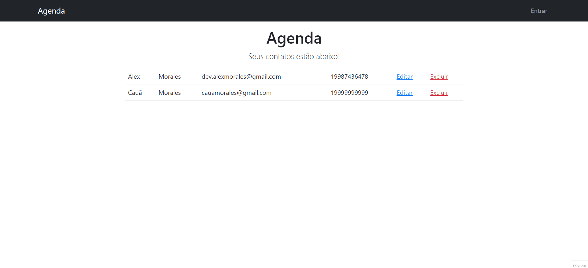

# Projeto Agenda - Node.js

Este projeto, desenvolvido como parte do curso de Node.js, é uma aplicação de lista telefônica que inclui funcionalidades de login e senha. O aplicativo utiliza o padrão MVC (Model-View-Controller) para organizar o código, realiza operações básicas de CRUD (Create, Read, Update, Delete), e integra o MongoDB como banco de dados. Além disso, foram utilizadas as bibliotecas dotenv, validator, e csurf para aprimorar funcionalidades e segurança.

## Descrição do Projeto

A aplicação de lista telefônica permite que os usuários gerenciem contatos. Cada contato possui as seguintes informações:

- Nome
- Sobrenome
- Número de Telefone
- E-mail

Para acessar algumas funcionalidades, como a adição, visualização, atualização e exclusão de contatos, o usuário precisa estar logado. O sistema de login utiliza e-mail e senha.

## Tecnologias Utilizadas

- **Node.js:** Plataforma de desenvolvimento server-side baseada no motor V8 do Google Chrome.
- **Express:** Framework web para Node.js, utilizado para simplificar o desenvolvimento de aplicações web.
- **MongoDB:** Banco de dados NoSQL utilizado para armazenar os dados dos contatos e informações de usuários.
- **EJS (Embedded JavaScript):** View engine para Node.js, facilitando a renderização de páginas HTML dinâmicas.
- **dotenv:** Biblioteca para carregar variáveis de ambiente a partir de um arquivo `.env`.
- **validator:** Biblioteca para validação de dados.
- **csurf:** Middleware para proteção contra ataques CSRF (Cross-Site Request Forgery).
- **Autenticação e Autorização:** Implementação de login com controle de sessão para acessar funcionalidades restritas.

## Estrutura do Projeto

A estrutura do projeto segue o padrão MVC, dividindo as responsabilidades em:

- **Model (models):** Responsável pela definição dos objetos e interações com o banco de dados MongoDB.
- **View (views):** Contém os arquivos EJS para renderização das páginas HTML.
- **Controller (controllers):** Gerencia as requisições do usuário, interagindo com os modelos e renderizando as views.
- **Middleware de Autenticação e Autorização:** Garante que apenas usuários autenticados tenham acesso a determinadas funcionalidades.

## Pré-requisitos

- Node.js instalado
- MongoDB instalado e em execução

## Como Executar o Projeto

1. Clone o repositório: `git clone https://github.com/Caahmos/ProjetoAgenda.git`
2. Acesse o diretório do projeto: `cd nome-do-repositorio`
3. Instale as dependências: `npm install`
4. Crie um arquivo `.env` na raiz do projeto e configure as variáveis necessárias, incluindo chaves secretas para a sessão.
5. Inicie o servidor: `npm start`
6. Abra o navegador e acesse `http://localhost:3000` para visualizar a aplicação.

## Contribuição

Contribuições são bem-vindas! Sinta-se à vontade para abrir issues, propor melhorias ou enviar pull requests.
